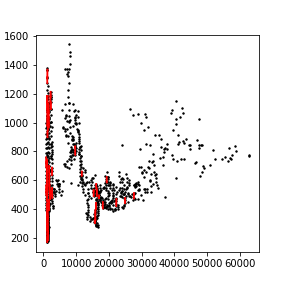
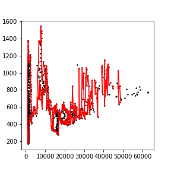
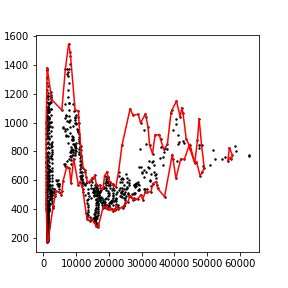
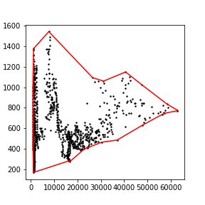
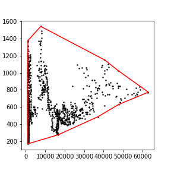
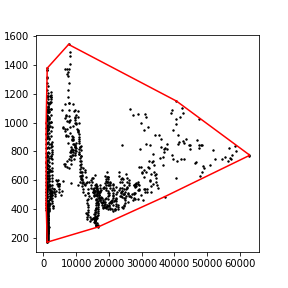

[](http://quantlet.de/)

## [](http://quantlet.de/) **A-Shape_CRIX_VCRIX** [](http://quantlet.de/)

```yaml

Name of QuantLet : A-Shape_CRIX_VCRIX

Published in : ''

Description : 'Several plots of Alpha Shapes over the scatter plot 0x=CRIX vs. 0y=VCRIX for different values of Alpha'

Keywords : 'Alpha shape (a-shape), CRIX, VCRIX'

See also : 'Scagnostic'

Author : Elena Ivanova

Submitted : Elena Ivanova

Datafile : 'TimeSeriesCRIX_VCRIX.csv'

Input:
            - TimeSeriesCRIX_VCRIX.csv    : Time Series of daily CRIX data in the period 2 May 2016 to 10 Nov 2018 (923 data points) 

Output:
            - 'several plots of Alpha Shapes of the scatter plot 0x=CRIX vs. 0y=VCRIX for different values of Alpha'

```















### [IPYNB Code: A-Shape_CRIX_VCRIX.ipynb](A-Shape_CRIX_VCRIX.ipynb)


automatically created on 2019-02-26