[](http://quantlet.de/)

## [](http://quantlet.de/) **A-Shape_Crystal** [](http://quantlet.de/)

```yaml

Name of QuantLet : A-Shape_Crystal

Published in : ''

Description : 
  - Delaunay Triangulation over a set of 10 points
  - Several plots of Alpha shapes over the same 10 points for different values of Alpha

Keywords : 'Delaunay Triangulation, Alpha shape (a-shape)'

Author : Elena Ivanova

Submitted : Elena Ivanova

Output: 
  - Delaunay Triangulation of a set of 10 points (the points are taken from Figure 6.1 from the notes to the course Theory of Combinatorial Algorithms by Prof. Emo Welzl taught at ETH Zürich https://www.ti.inf.ethz.ch/ew/Lehre/CG13/lecture/Chapter%206.pdf)
  - several plots of Alpha shapes over the same 10 points for different values of Alpha
            

```

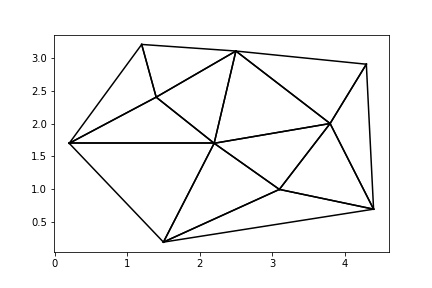

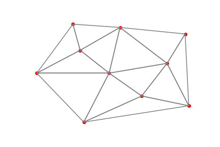

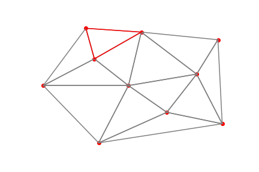

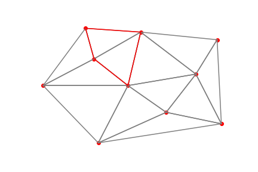

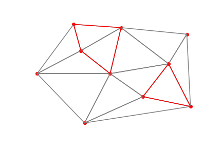


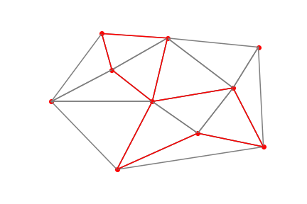

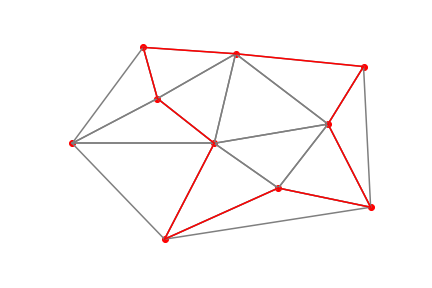

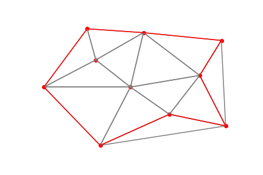

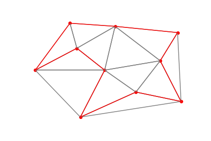

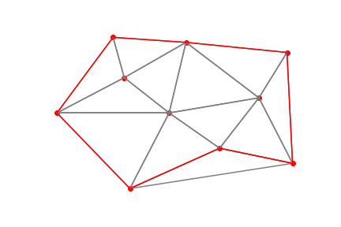

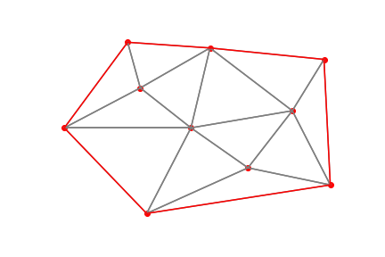

### [IPYNB Code: A-Shape_Crystal.ipynb](A-Shape_Crystal.ipynb)


automatically created on 2019-02-26