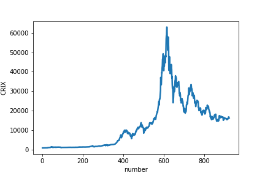
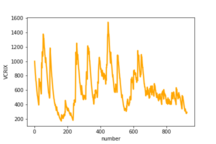

[](http://quantlet.de/)

## [](http://quantlet.de/) **TS_CRIX_VCRIX** [](http://quantlet.de/)

```yaml

Name of QuantLet : TS_CRIX_VCRIX

Published in :

Description : 'Time Series of daily CRIX data in the period 2 May 2016 to 10 Nov 2018; all together 923 data points Time Series of the VCRIX (CRIX volatility)'

Keywords : 'Time Series (TS), CRIX, VCRIX'


Author : Elena Ivanova

Submitted : Elena Ivanova

Datafile : 'TimeSeriesCRIX_VCRIX.csv'

Input:
  - TimeSeriesCRIX.csv : Time Series of daily CRIX data and their volatility VCRIX in the period 2 May 2016 to 10 Nov 2018 (923 data points) 

Output: 
  - Plot of the Time Series of daily CRIX data (02. May 2016-10. Nov 2018)
  - Plot of the CRIX volatility VCRIX

```





### [IPYNB Code: TS_CRIX_VCRIX.ipynb](TS_CRIX_VCRIX.ipynb)


automatically created on 2019-02-26